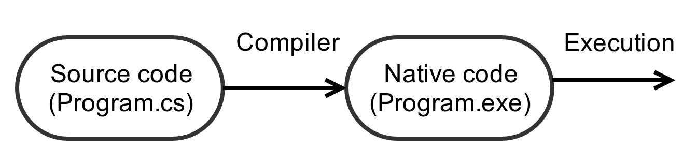
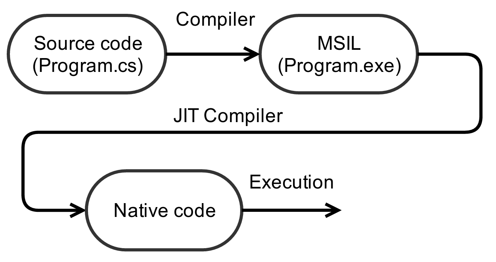

\titlepage

## Overview
\tableofcontents


# Introduction

## History

> - Microsoft's answer to Java
> - January 1999: Anders Hejlsberg and his team start working on `Cool` (C-like
  Object Oriented Language)
> - July 2000: .NET and C# are announced

## Design

### Anders Hejlsberg
- Not a Java clone and is much closer to C++

## Name

> - `C`
> - `C++`
> - `C++++`
> - `C#`

## Characteristics

> - Strongly typed
> - Imperative, procedural
> - Functionnal since C# 3.0
> - Object oriented
> - Object oriented
> - OBJECT ORIENTED

## Classic compilation



## C# compilation

> - Use of an intermediate language
> - MSIL (MicroSoft Intermediate Language)
> - JIT (Just In Time) compiler

## C# compilation



## .NET

> - Software Framework
> - Developed by Microsoft
> - Includes large class library (FCL)
> - Language Interoperability
> - VisualStudio largely made for .NET

# Syntax

## Types

> - Uninitialized

> - `<type> <name>;`

> - Initialized

> - `<type> <name> = <value>;`

## Arrays

```cs
<type>[] <name>;
<type>[] <name> = <variable>;
<type>[] <name> = new <type>[<size>];
```

## Examples

```cs
int answer = 42;
float pi = 3.14f;
string rule = "The code is the law.";
long bignum = 9223372036854775807;

int[] array = new int[14];
int[] samearray = array;
```
## Operators

> - `+(=)`
> - `++`
> - `-(=)`
> - `--`
> - `*(=)`
> - `/(=)`
> - `%(=)`

## Comparison operators

> - `==`
> - `!=`
> - `<(=)`
> - `>(=)`

## Example

```cs
int answer = 20 * 2 + 2
// answer = 42
answer += 2;
// answer = 44
answer++;
//answer = 45
bool test = answer == 45;
// test = true
bool othertest = (answer % 2) == 0;
// test = false
string rule = "The code is " + "the law.";
// rule = "The code is the law"
```

## Using arrays

```cs
int[] foo = new int[2];
foo[0] = 14;
// the first value of the array is 14
foo[1] = 41;
// the secod value of the array is 41
foo[2] = 2021;
// goodbye world...
```

## Warning !

```cs
int foo = 42;
int bar = foo;
bar = 21;
```

> - What is the value of foo ?
> - 42

## Warning !

```cs
int[] foo = new int[2];
foo[0] = 42;
int[] bar = foo;
bar[0] = 21;
```

> - What is the value of foo?
> - 21

## Functions

```cs
<type> <name>(<type1> <name1>, <type2> <name2>, ...)
{
  //Function body
  return <value of type <type>>
}
```

## Examples

```cs
string hello(string who)
{
  return "Hello " + who + "!";
}

void hello2(string who)
{
  Console.WriteLine("Hello " + who + "!");
  //No return needed
}
```

## Functions calls

```cs
string hey = hello("ACDC");
//hey = "Hello ACDC!"
hello2("world");
```

## Arguments passed by reference

```cs
<type> <name>(ref <paramtype> <paramname>)
{
  //function body
}
```

## Arguments passed by reference - example

```cs
int i = 14;
int n = 42;
void useless(ref int i, int n)
{
  n += i;
  i++;
}

useless(ref i, n);  // Ok
useless(ref i, 42); // Ok
useless(ref 14, n); // Impossible

```
> - What are the values of n and i ?
> - n = 42
> - i = 15

# Imperative programming

## My computer, my slave

> - Make me a sandwich;
> - Sing me a song;
> - Do my homework;
> - While the floor is dirty, wash the floor
> - If the phone is ringing, answer the phone

## Control structures - if

```cs
if (<condition>)
{
  // condition is true
}
else if (<condition2>) // Optional
{
  // condition1 is false and condition2 is true
}
else // Optional
{
  // condition1 and condition2 are false
}
```

## Control structures - switch

```cs
switch (<variable>)
{
  case <case1>:
    //instruction if <variable> == <case1>
    break;
  case <case2>:
    //...
    break;
  default:
    //when the variable matches no case
    break;
}
```

## Switch example

```cs
//year = ...
switch(year)
{
  case 2017:
    return "Monsters...";
  case 2019:
    return "The bests";
  default:
    return "You can do it !";
}
```

## Loops - while & do while

```cs
while (<condition>)
{
  // while body
}

do {
  // do while body
} while (<condition>);
```

## Loops - examples

```cs
int i = 1;
while (i < 42)
{
  i = i * 2;
}

string who = "";
do {
  Console.WriteLine("Hello who ?");
  name = Console.ReadLine();
} while (name == "");
```

## Loops - for

```cs
for (<initial>; <condition>; <instruction>)
{
  // for body
}
```

## for - examples

```cs
int[] array = new int[10];
array[0] = 14;
for (int i = 1; i < array.Length; i++)
{
  array[i] = i;
}
// array = 14, 1, 2, 3 ...
```

## Loops - foreach

```cs
foreach(<type> <name> in <collection>)
{
  //foreach body
}
```

## foreach - examples

```cs
string[] names = {"Hazriel", "mevouc", "reaper"};
foreach (string name in names)
{
  Console.Writeline("Hello " + name);
}

foreach (string name in names)
{
  name = "NO."; // Will not compile
}
```

# Questions?

# Object Oriented Programming

## What is OOP?

> - New way of thinking
> - Existence of patterns
> - Create objects from these patterns
> - Make these objects interact

## A class

```cs
class Window
{
  // Fields
  int width;
  int height;
  float opacity;
  bool hasShutter;
  [...]
}
```

## A class with methods

```cs
class Meven
{
  int height; // Pretty small
  Color eyesColor;

  // Methods
  string GetName();
  void Work();
  void Sleep();
  bool IsTired();
  [...]
  void GetNaked();
}
```

## Create objects

> - How do I create an object?
> - Use the keyword *new*
> - *new* is used with class constructor

## Call an object's method

```cs

public static void Main(string[] args)
{
  Meven meven = new Meven();

  // Then you can call meven's methods
  if (meven.IsTired())
    meven.Sleep();
  else
    meven.Work();
}

```

## Constructor

> - What is a class constructor?
> - Instanciate a new object
> - Pass parameters along with it
> - You can have several constructors per class
> - Default constructor given if not specified


## Example

```cs

class Human
{
  // Fields
  string name;
  int height;
  int age;
  [...]

  // Methods
  string GetName();
  void Work();
  void Sleep();
  [...]
}

```

## Example

```cs

public class Human
{
  public Human()
  {
    // Initialize fields the way you want
    this.name = "Un mec random";
    this.age = 40;
  }

  public Human(int age, string name)
  {
    this.name = name;
    this.age = age;
  }

  // Fields and methods
  [...]
}

```

## Example

```cs

public static void Main(string[] args)
{
  Human human = new Human();
  Human martin = new Human(20, "Martin");

  human.GetName(); // Returns "Un mec random"
  martin.GetName(); // Returns "Martin"
}

```
## Static fields in a class

> - A static field is common to every instance of a class
> - Cannot be accessed from instance
> - Cannot be accessed with *this*

## Static Class

> - Every field is static
> - Cannot be instanciated
> - Fields are accessed with full name

## Example

```cs

class Fruit
{
  public static int count = 0;
  public Fruit()
  {
    count++;
  }

  // Fields ...
}

```

## Example

```cs

public static void Main(string[] args)
{
  Fruit f1 = new Fruit();
  Fruit f2 = new Fruit();
  Fruit.count; // count = 2
}

```

## Introduction to access modifiers

```cs

class Women
{
  // Fields ...
  public bool isEasilyTriggered;

  [...]

  public string GetName();
  public int GetAge();
  private void GetNaked();
}

```

## Introduction to access modifiers

```cs

public static void Main(string[] args)
{
  Women femme = new Women();
  femme.GetName(); // Returns the name
  femme.GetAge(); // Returns the age
  femme.GetNaked(); // Error
}

```

# Access modifiers

## Access modifiers

```cs

class Date
{
  private int day;
  private int month;
  private int year;

  public Date(int day, int month, int year)
  {
    // Check validity...
  }
}

```

## `private` vs `public`

> - `private`: only accessible from within the class
> - `public`: everyone can see it and modify it
> - `internal` : only accessible from within the current assembly

## `private` vs `public`

```cs

class Date
{
  private int day;
  private int month;
  private int year;

  public Date(int day, int month, int year)
  {
    // Check validity...
  }
}

```
> - What if we want to modify the date later on?

## Getters and setters

```cs

class Date
{
  private int day;
  private int month;
  private int year;

  public int GetDay() { return this.day; }
  public void SetDay(int day)
  {
    if (day > 0 || day <= 31)
      this.day = day;
    else
      // Discard
  }
}

```

## Getters and setters

> - Methods in a class
> - Used to access private fields from outside the class
> - Used to monitor the changes made to a field

## Drawbacks

> - Need to write two functions per field
> - Leads to heavy classes
> - Solution?

## Properties

```cs

class Date
{
  private int day; // Backing field

  public int Day
  {
    get { return this.day; }
    set
    {
      if (value > 0 || value <= 31)
        this.day = value;
    }
  }
}

```

## Properties

> - A public attribute
> - Sub methods : *get* and *set*
> - Used to monitor the access to the backing field

## Auto-Implemented properties

```cs

class Human
{
  public string Name { get; set; }
  public string Gender { get; set; }
  public int Age { get; private set; } // Read only
}

```

## Auto-Implemented properties

> - Way faster to write
> - Used when there's no need to monitor parameters
> - Backing field created in background

## Inheritence

```cs
class Human
{
  private int age;
  private string name;

  public Human(string name)
  {
    this.age = 1;
    this.name = name;
  }
 
  public void Work();
  public void Sleep();
}
```

## Inheritence

```cs

class Pirate : Human
{
  private int treasure;

  public Pirate(string name) : base(name)
  {
    this.treasure = 0;
  }

  public Pirate(string name, int age)
  {
    this.name = name; // Error
    this.age = age; // Error
  }
}

```

## Inheritence

> - Use `ClassName : BaseClass` to base `ClassName` on `BaseClass`
> - Every field is inherited from the base class
> - *base* is used to access to the base class
> - A new keyword comes with inheritence

## `protected`

> - Another access modifier
> - Only visible in a derived class and the class itself

## `protected`

```cs

class Human
{
  protected int age; // Can be accessed from the pirate class
  protected string name;

  public Human(string name)
  {
    this.age = 1;
    this.name = name;
  }
 
  public void Work();
  public void Sleep();
}

```

## Abstract class

```cs

public abstract class Human
{
  // Fields
  [...]
  
  public void Work();
  public void Sleep();
}

```

## Abstract class

```cs

public class Women : Human
{
  // Override Human.Work()
  public override void Work()
  {
    // ...
  }
}

```

## Abstract class

> - *abstract* is used to create pure patterns
> - Cannot instanciate an abstract class
> - *override* is used to replace previous definitions of methods

## Interfaces

> - Contains the signature of methods and properties
> - A class can implement several interfaces
> - Each signature must be defined by the class when implementing
> - Classes implementing the same interface can be grouped

## Interfaces

```cs

interface ISneaky
{
  public void Steal();
  / ...
}

```

## Interfaces

```cs

class Meven : ISneaky
{
  // Must define the method Steal()
}

class Martin : ISneaky
{
  // Must define the method Steal()
}

```

## Interfaces

```cs

public static void Main(string[] arg)
{
  Meven meven = new Meven();
  Martin martin = new Martin();
  List<ISneaky> list = new List<ISneaky>();
  list.Add(meven);
  list.Add(martin);
}

```

# Questions?

# Advanced C\#

## Useful keywords

> - `var`
> - `typeof`
> - and more… (`explicit`, `yield`, `try`, `unsafe`, etc.)

## var

```cs
MyClassWithABigName obj = new MyClassWithABigName();

// is equivalent to

var obj = new MyClassWithABigName();
```


## initialize with null

```cs
Acdc shepard = new Acdc();
shepard.Teach();
shepard = null;

var hazriel = new Acdc();
hazriel.Teach();
hazriel = null;

var reaper = null;
// Compilation failed
```

## typeof

> - Get the `System.Type` of a type
> - Useful when used with the `GetType` method

## typeof

```cs
Human[] people = new Human[42];
[...] // set content of people

foreach (var person in people)
{
  Type type = person.GetType();
  if (type.Equals(typeof (Acdc)))
    person.Teach();
  else
    person.Sleep();
}
```


## Namespaces

> - Scopes where a set of related classes is implemented.
> - Namespaces may nest, sub-namespaces are accessed using `.`.
> - Namespaces use visibility. One can declared a class as private (only
  accessible in the current namespace) or public (accessible from anywhere).

## Usefulness of namespaces

```cs
System.Speech.Synthesis.SpeechSynthesizer synthesizer
= new System.Speech.Synthesis.SpeechSynthesizer();

synthesizer.Speak("I am only available on Windows.");

[...] // other stuff using long identifier
```

## Use a namespace

```cs
using System.Speech.Synthesis.SpeechSynthesizer;

SpeechSynthesizer synthesizer2 = new SpeechSynthesizer();

synthesizer2.Speak("I was declared in a simplier way.");
```

## Operators overloading

> - Define operations between created types.
> - Allow to use the simple symbols `+`, `-`, `*`, etc.

## Example

```cs
class Vector2
{
  private int x;
  private int y;
  public Vector2(int x, int y)
  {
    this.x = x;
    this.y = y;
  }

  public static Vector2 operator +(Vector2 u, Vector2 v)
  {
    return new Vector2 (u.x + v.x, u.y + v.y);
  }
}
```

## Example

```cs
var a = new Vector2(42, 42);
var ab = new Vector2(13, 69);

var b = a + ab;
// b.x = 55 && b.y = 111
```

## Generics

> - Define type-safe data structures.
> - Avoid duplication of code.

## Example - stack

```cs
public class Stack<T>
{
  private T val;
  private Stack<T> next;

  /* equivalent to Push */
  public Stack<T>(T val, Stack<T> stack)
  {
    this.val = val;
    this.next = stack;
  }

  // ...
```

## Example - Stack

```cs
  // ...

  public T Peek()
  {
    return val;
  }

  public Stack<T> Pop()
  {
    return next;
  }
}
```

## Usage

```cs
Stack<int> stack = null;

for (int i = 0; i < 7; ++i)
  stack = new Stack<int>(i, stack);
// stack = 6 -> 5 -> 4 -> 3 -> 2 -> 1 -> 0 -> null

int four = stack.Pop().Pop().Peek();

Stack<int> tail = stack.Pop();
```

## Usage 2

```cs
Stack<double> stack = null;

for (double i = 0.0; i < 7.0; ++i)
  stack = new Stack<double>(i, stack);
// stack = 6. -> 5. -> 4. -> 3. -> 2. -> 1. -> 0. -> null

double four = stack.Pop().Pop().Peek();

Stack<double> tail = stack.Pop();
```

## Functionnal programming

> - Function types (create objects which are functions)
> - Function values (assign functions or methods)
> - Function arithmetic (add or substract functions)

## Func, Predicate, Action

```cs
Func<double, double> f = Math.Exp;
double e = f(1);

/* Func<string, void> act ... */
Action<string> act = Console.WriteLine;

/* Func<string, string, bool> p ... */
Predicate<string, string> p = String.Equals;
string str = "Test.";

if (p(str, "Test."))
  act("Votai");
```

## delegate, lambdas, anonymous functions

```cs
Func<int, int> MultAnswer
= delegate(int x) { return 42 * n; };

// is equivalent to

Func<int, int> MultAnswer = n => 42 * n;

int answer = MultAnswer(1);
// answer = 42
```

## Function arithmetic

```cs
Action<string> hello =
  str => Console.WriteLine("Hello {0}!", str);

Action<string> bye =
  str => Console.WriteLine("Bye {0}…", str);

Action<string> greetings = hello + bye;

greetings("Hazriel");
// Hello Hazriel!
// Bye Hazriel…

(greetings - hello)("Shepard");
// Bye Shepard…
```

# Questions?
